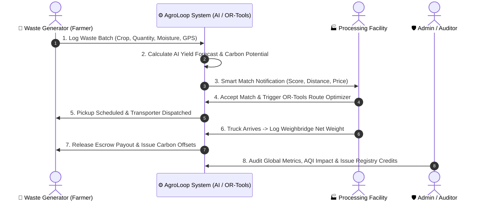

# 🌱 AgroLoop / Circular Biomass Platform — Product Architecture & Page Specifications

An AI-driven, end-to-end circular economy platform connecting agricultural waste producers (**Generators**), biorefineries & processing units (**Facilities**), and oversight bodies (**Admins**) to eliminate stubble burning, optimize multi-stop logistics, and monetize carbon offsets.

---

## 📑 Table of Contents
1. [Platform Architecture & Portals Overview](#-platform-architecture--portals-overview)
2. [🌿 1. Generator Portal (Waste Logging & Offsets)](#-1-generator-portal-waste-logging--offsets)
3. [🛡️ 2. Admin Portal (System Oversight)](#️-2-admin-portal-system-oversight)
4. [🏭 3. Facility Portal (Intake, Routing & Plant Specs)](#-3-facility-portal-intake-routing--plant-specs)
5. [🔄 Cross-Role Interactions & Core Data Flows](#-cross-role-interactions--core-data-flows)
6. [💡 Strategic Recommendations & High-Impact Additions](#-strategic-recommendations--high-impact-additions)

---

## 🏛️ Platform Architecture & Portals Overview

| Portal | Target Persona | Primary Objective | Key Technologies |
| :--- | :--- | :--- | :--- |
| **Generator Portal** | Farmers, Agro-Industries, Food Processors | Log biomass, forecast yields, discover buyers, earn carbon credits | AI Forecasting, Geolocation, Matching Engine |
| **Admin Portal** | System Operators, Regulators, ESG Auditors | Full ecosystem oversight, logistics monitoring, compliance, fraud prevention | Macro ML Models, Analytics, Heatmaps |
| **Facility Portal** | Bio-CNG / Pellet / Ethanol / Compost Plants | Procure feedstock, optimize multi-stop pickup routes, manage storage capacity | Google OR-Tools, Telemetry, OCR Weighbridge |

---

## 🌿 1. Generator Portal (Waste Logging & Offsets)

### 1.1. Dashboard
- **Use Case:** Instant operational summary of logged biomass, active collections, and revenue/credits earned.
- **Core Features:**
  - KPI metric cards: *Total Waste Logged (Tons)*, *Pending Pickups*, *Revenue Earned*, *CO₂ Avoided*.
  - Live batch progress stepper (*Logged* $\rightarrow$ *Matched* $\rightarrow$ *In Transit* $\rightarrow$ *Processed*).
  - Quick action CTA buttons: `+ Log New Batch` & `View Matched Facilities`.
- **Why It Exists:** Provides rapid situational awareness and financial ROI tracking without navigation friction.
- **Recommendations:**
  - ➕ **Add:** Seasonal harvest countdown and local weather advisory banner.
  - ➖ **Remove:** Complex fleet diagnostics or plant boiler specifications.

---

### 1.2. Partner Map
- **Use Case:** Visual discovery of nearby biorefineries, biomass pellet hubs, and composting plants.
- **Core Features:**
  - Map radius filter (e.g., `< 25km`, `< 50km`, `< 100km`).
  - Facility markers color-coded by plant type (Biogas, Pellets, Ethanol, Compost).
  - Distance, freight estimate, and current purchasing price per ton.
- **Why It Exists:** Enables local discovery and cuts down empty transport miles by finding the closest viable buyer.
- **Recommendations:**
  - ➕ **Add:** "Active Buying" live status indicator badge on map pins.
  - ➕ **Add:** 1-Click "Request Direct Quote" action.

---

### 1.3. Log Waste Batches (CRUD)
- **Use Case:** Central data entry and management for all agricultural residue batches.
- **Core Features:**
  - Waste batch creation form: Residue Category (Paddy Stubble, Bagasse, Husk, Manure, Food Waste), Moisture %, Quantity (Tons), Available Pickup Window, GPS Location.
  - Photo attachment & lab moisture report upload.
  - Filterable inventory table (*Draft, Active, Matched, Collected, Completed*).
- **Why It Exists:** The fundamental CRUD intake point that feeds inventory into the matching algorithm.
- **Recommendations:**
  - ➕ **Add:** Bulk CSV upload for farming cooperatives and large estates.
  - ➕ **Add:** Camera photo capture with quick AI moisture/type auto-fill.
  - ➖ **Remove:** Hyper-specialized chemical taxonomy fields (keep standard crop defaults).

---

### 1.4. AI Yield Forecast (ML)
- **Use Case:** Predictive yield modeling for upcoming harvest biomass residue before harvest occurs.
- **Core Features:**
  - Crop type, acreage/field size, sowing date, and historical yield trend inputs.
  - ML output visualization: Estimated tons of upcoming residue and ideal collection windows.
  - Advance notification trigger to nearby plants.
- **Why It Exists:** Prevents emergency stubble burning by securing buyers weeks before harvest begins.
- **Recommendations:**
  - ➕ **Add:** "Convert Forecast to Advance Listing" 1-click button.
  - ➕ **Add:** Unseasonal rainfall warning that affects drying schedules.

---

### 1.5. Smart Matching (AI Match)
- **Use Case:** Automated algorithmic pairing of logged batches with the highest-paying or nearest processing plants.
- **Core Features:**
  - AI Match Score (%) based on travel distance, plant acceptance limits, moisture tolerance, and bid price.
  - Bid comparison cards (Price vs. Proximity vs. Transport Availability).
  - "Accept Offer" / "Negotiate Terms" action buttons.
- **Why It Exists:** Cuts out middlemen, ensures fair pricing for farmers, and optimizes network economics.
- **Recommendations:**
  - ➕ **Add:** Route-share detection (shows if a truck is already passing by).
  - ➕ **Add:** Digital contract / gatepass generation on deal acceptance.

---

### 1.6. Carbon Offsets
- **Use Case:** Quantifying, verifying, and monetizing emissions avoided by not burning crop residue.
- **Core Features:**
  - Carbon savings ledger: $X$ Tons of crop residue diverted $= Y$ Tons of CO₂e saved.
  - Downloadable audited certificates of avoidance.
  - Credit redemption / payout interface (Convert to direct cash bonuses, subsidies, or bio-fertilizers).
- **Why It Exists:** Serves as a vital financial motivator to prevent open-field stubble burning.
- **Recommendations:**
  - ➕ **Add:** Real-time voluntary carbon market token/price index integration.

---

## 🛡️ 2. Admin Portal (System Oversight)

### 2.1. Dashboard
- **Use Case:** High-level platform health, aggregate biomass metrics, transaction volumes, and critical alerts.
- **Core Features:**
  - Global KPI grid: Active Generators, Verified Facilities, Biomass Diverted (MT), Fleet Trips in Progress, Platform Revenue.
  - Critical system alerts (Unmatched expiring batches, route delays, unverified registrations).
  - Real-time audit activity feed.
- **Why It Exists:** Gives administrators full situational awareness across supply, demand, and operations.
- **Recommendations:**
  - ➕ **Add:** Regional Air Quality Index (AQI) heatmap overlay to prioritize high-risk stubble burning zones.

---

### 2.2. Network Map
- **Use Case:** Real-time geospatial tracking of all participants, active supply clusters, and moving logistics fleets.
- **Core Features:**
  - Dynamic map layer toggles: (1) Generators, (2) Processing Plants, (3) Live Freight Vehicles, (4) High-Density Supply Clusters.
  - Cluster analytics identifying regional supply surpluses or raw-material deficits.
- **Why It Exists:** Facilitates strategic regional planning and rapid identification of logistics bottlenecks.
- **Recommendations:**
  - ➕ **Add:** Filter by specific feedstock type (e.g., view only paddy straw density vs bio-CNG plants).

---

### 2.3. Waste Generators
- **Use Case:** Directory, verification, KYC compliance, and audit history for all registered waste producers.
- **Core Features:**
  - Filterable data table (Verification status, region, total biomass supplied, reliability rating).
  - Generator profile drawer: Farm size, land title/KYC docs, historical batch records, transaction ledger.
  - Administrative actions: Approve KYC, Flag Anomaly, Suspend Account.
- **Why It Exists:** Protects platform integrity against fraudulent listings and ghost supply claims.
- **Recommendations:**
  - ➕ **Add:** Anomaly detection alert (e.g., generator reporting biomass tonnage inconsistent with land acreage).

---

### 2.4. Facilities
- **Use Case:** Comprehensive management, licensing verification, and intake monitoring for all processing plants.
- **Core Features:**
  - Plant profiles: Daily intake capacity (MT/Day), accepted moisture range, current storage silo levels, environmental permits.
  - License and pollution control board certification expiry tracker.
  - Operational capacity utilization metrics.
- **Why It Exists:** Ensures all buying facilities are legally compliant and within safe operating thresholds.
- **Recommendations:**
  - ➕ **Add:** Auto-rerouting trigger when a facility reaches $>95\%$ silo capacity.

---

### 2.5. AI Forecast
- **Use Case:** Macro-level regional supply-demand forecasting across districts and agricultural seasons.
- **Core Features:**
  - Regional 30/60/90-day biomass production models aggregated across districts.
  - Regional feedstock deficit vs surplus forecasting.
- **Why It Exists:** Enables policymakers and industrial buyers to plan seasonal procurement and subsidy allocations.
- **Recommendations:**
  - ➕ **Add:** Exportable executive summary PDFs for environmental agency reporting.

---

### 2.6. Smart Matching
- **Use Case:** Algorithmic oversight, weighting adjustments, and manual matching overrides.
- **Core Features:**
  - Matching algorithm tuning controls (adjust weights for Distance, Price, Plant Priority, Transit Speed).
  - Unmatched batch escalation queue with 1-click manual dispatch.
  - Algorithm efficiency metrics (Match success rate %, average time-to-match).
- **Why It Exists:** Resolves edge cases in remote or underserved areas where automated matching fails.
- **Recommendations:**
  - ➕ **Add:** "Match Simulation Sandbox" to test algorithm adjustments before live deployment.

---

### 2.7. Route Logistics
- **Use Case:** Centralized oversight of multi-stop transport fleets, driver schedules, and trip delay resolution.
- **Core Features:**
  - Active dispatch board (Vehicle ID, Assigned Transporter, Route Waypoints, Live ETA, Delay Status).
  - Fleet payload efficiency metrics (detecting under-utilized truck capacity).
- **Why It Exists:** Transport represents up to 50% of biomass procurement costs; central optimization guarantees profitability.
- **Recommendations:**
  - ➕ **Add:** Driver SOS & vehicle breakdown incident workflow.

---

### 2.8. Carbon Impact
- **Use Case:** Comprehensive platform-wide carbon audit, registry issuance compliance, and ESG reporting.
- **Core Features:**
  - Aggregated impact metrics: Total CO₂ avoided, Methane mitigated, Clean energy generated (MWh/Nm³ Bio-CNG).
  - Carbon credit minting ledger and audit report generator.
- **Why It Exists:** Verifies carbon claims for global registry certification (e.g., Verra, Gold Standard) and ESG audits.
- **Recommendations:**
  - ➕ **Add:** Direct registry API sync status for automated certification issuance.

---

## 🏭 3. Facility Portal (Intake, Routing & Plant Specs)

### 3.1. Dashboard
- **Use Case:** Daily operational command center for plant supervisors, silo levels, and inbound delivery tracking.
- **Core Features:**
  - Real-time silo/bunker storage fill gauges (e.g., *Bunker A: 68%*, *Bunker B: 34%*).
  - Inbound truck schedule with estimated arrival times.
  - Average incoming moisture % and daily processing throughput.
  - Quick action buttons: `Log Inbound Delivery` & `Update Plant Capacity`.
- **Why It Exists:** Prevents weighbridge congestion and protects plant boilers/digesters from feedstock starvation.
- **Recommendations:**
  - ➕ **Add:** Emergency intake pause toggle (stops incoming matches during plant maintenance).
  - ➖ **Remove:** Global carbon registry trading controls (keep to dedicated reporting tab).

---

### 3.2. Operations Map
- **Use Case:** Live telemetry and route monitoring of all trucks inbound to or outbound from this specific facility.
- **Core Features:**
  - Interactive map showing active truck pins and designated route corridors.
  - Truck status badges: *Loading at Farm*, *En Route*, *At Weighbridge*, *Unloading*.
  - Geofenced arrival alerts triggering yard preparation 15 minutes before arrival.
- **Why It Exists:** Streamlines yard logistics and reduces driver turnaround time at the gate.
- **Recommendations:**
  - ➕ **Add:** Live traffic congestion alerts on primary haulage routes.

---

### 3.3. Facility Management (Capacity)
- **Use Case:** Configuring plant technical parameters, moisture limits, and storage boundaries.
- **Core Features:**
  - Feedstock acceptance criteria (e.g., Paddy Straw: Moisture $<18\%$, Bagasse: Moisture $<50\%$).
  - Storage silo/bunker capacity configuration (Total MT capacity, current MT stored).
  - Planned maintenance downtime calendar.
- **Why It Exists:** Feeds strict boundary constraints into the matchmaking engine so plants only receive compatible material.
- **Recommendations:**
  - ➕ **Add:** Configurable quality deduction matrix (e.g., deduct 2% payout per 1% excess moisture).

---

### 3.4. Logistics & Routes (OR-Tools)
- **Use Case:** Multi-stop pickup route optimization using Google OR-Tools to minimize fleet mileage and fuel costs.
- **Core Features:**
  - Multi-farm pickup run generator (combines multiple small farm loads into a single truck run).
  - OR-Tools optimization output: Optimal stop order, estimated diesel consumption, route duration, toll costs.
  - 1-Click Driver Dispatch button (sends digital manifest directly to driver).
- **Why It Exists:** Low-density crop waste requires batch consolidation to make transport economically viable.
- **Recommendations:**
  - ➕ **Add:** Vehicle selector dropdown (e.g., 5-Ton Tipper, 16-Ton Trailer, Tractor-Trolley).
  - ➕ **Add:** Route comparison toggle (Fastest Route vs. Lowest Fuel / Lowest Carbon Route).

---

### 3.5. Feedstock Sourcing (Intake)
- **Use Case:** Procurement marketplace, reviewing available generator batches, placing bids, and logging weighbridge receipts.
- **Core Features:**
  - Feedstock marketplace (Filter available supply by crop type, distance, price, and moisture).
  - Long-term offtake contract manager.
  - Inward Weighbridge Gate Logger (Gross Weight, Tare Weight, Net Weight, Quality check status).
- **Why It Exists:** Ensures consistent, cost-effective feedstock supply for non-stop industrial processing.
- **Recommendations:**
  - ➕ **Add:** OCR Weighbridge Slip scanning for instant automatic entry.

---

### 3.6. Carbon Sequestration
- **Use Case:** Measuring and certifying carbon reduction from converting biomass into Bio-CNG, pellets, biochar, or compost.
- **Core Features:**
  - Conversion carbon calculator (Biomass volume $\rightarrow$ Bio-CNG yield $\rightarrow$ Net fossil fuel displacement).
  - Life Cycle Assessment (LCA) compliance reports.
  - Green certificates generator for industrial buyers and tax credit incentives.
- **Why It Exists:** Allows plants to monetize green premiums and claim government renewable energy incentives.
- **Recommendations:**
  - ➕ **Add:** Biochar / CBG compliance certification export for tax rebate claims.

---

## 🔄 Cross-Role Interactions & Core Data Flows

---

## 💡 Strategic Recommendations & High-Impact Additions

1. **📱 Transporter / Driver Role (Optional 4th Role or Companion View):**
   * Mobile-friendly view with Turn-by-Turn GPS navigation, multi-stop pickup checklists, and QR code digital gate-passes.
2. **🔔 Multi-Channel Alert System (SMS / WhatsApp):**
   * Essential for rural agricultural producers who operate without constant internet/desktop access.
3. **💳 Escrow & Instant Payout Integration:**
   * Automated escrow hold upon match acceptance, released automatically once the facility weighbridge logs verified net weight.
4. **🏷️ Standardized Sidebar Navigation Naming:**
   * **Generator Portal:** Rename `Log Waste Batches` $\rightarrow$ `My Waste Batches (CRUD)`
   * **Facility Portal:** Rename `Feedstock Sourcing` $\rightarrow$ `Feedstock Intake & Sourcing`
   * **Facility Portal:** Rename `Logistics & Routes` $\rightarrow$ `Smart Route Optimization (OR-Tools)`
